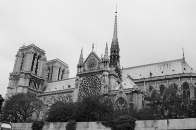
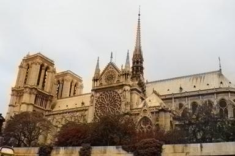
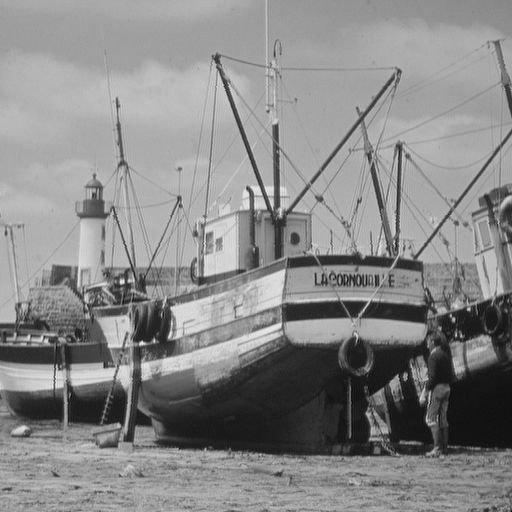
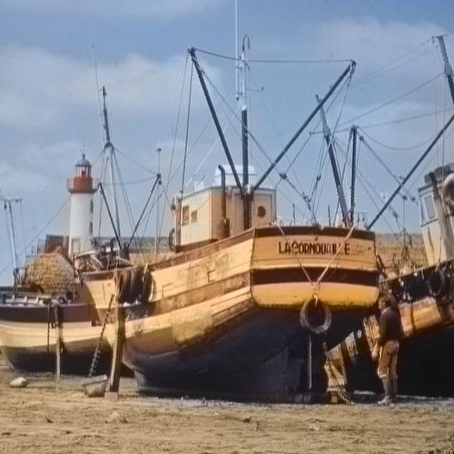

# Colorization automatic

## To successfully use this project, you need to execute the following steps.
```
1 pip install -r requirements.txt # Check and install all packages requirements in python
```
```
2. Download the weight from follwing link
```
[Google Drive](https://drive.google.com/file/d/1Idx_Pm_vL8jebSbNW4kdfDlq_MjfTzhN/view?usp=sharing)

You need to unzip and put all the files at ./models/

## All our work exists in two versions jupyter notebook and python script

We recommand to use [jupyter notebook](https://jupyter.org/install) to open all .ipynb files

It's also possible to use the command line python for .py files

You should use python script in the following ways
```
python script.py input_image output_image
```
  

  

  


[The orignal paper](https://arxiv.org/pdf/1603.08511.pdf)
Richard Zhang, Phillip Isola, Alexei A. Efros. In ECCV, 2016.
